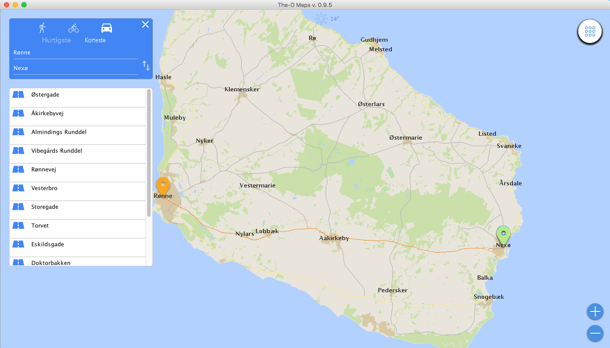

  

The-D Maps was developed at  the [IT University of Copenhagen](https://itu.dk) as part of our first year project, map of Denmark. Visualization, navigation, searching, and route planning

## Authors

- Anton Mølbjerg Eskildsen

- Jakob Staugaard  

- Jannik Munk Bryld  

- Jonleif Huneck Davidsen  

- Lucas Schønrock  

- Stefanie Schor Olafsdottir

